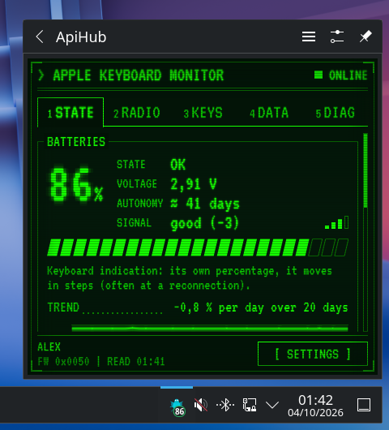
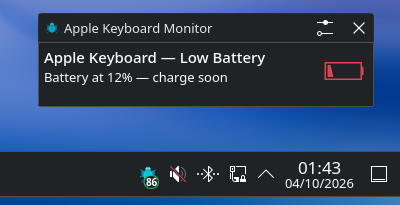
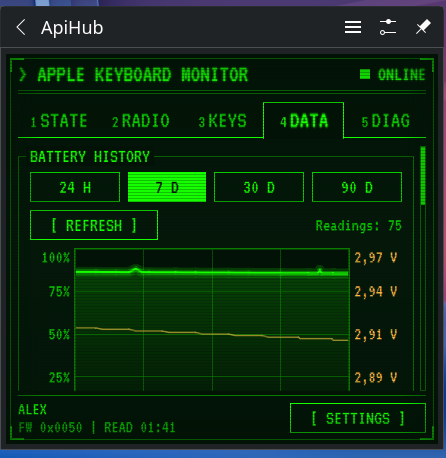
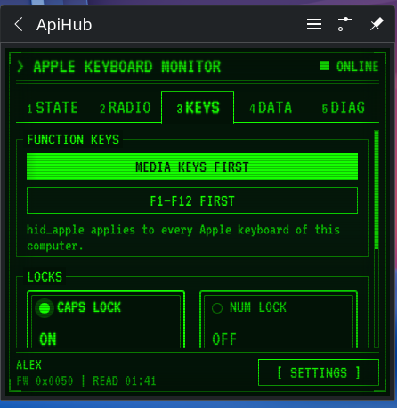
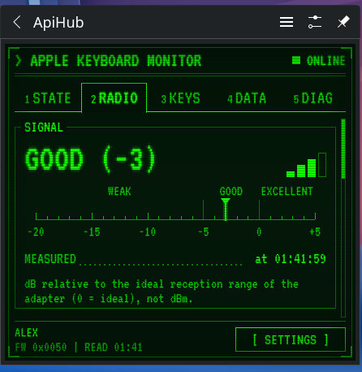
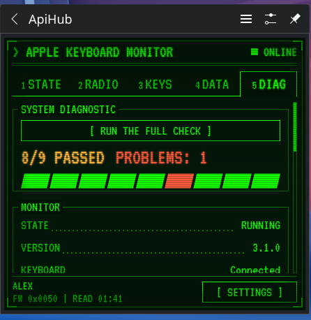
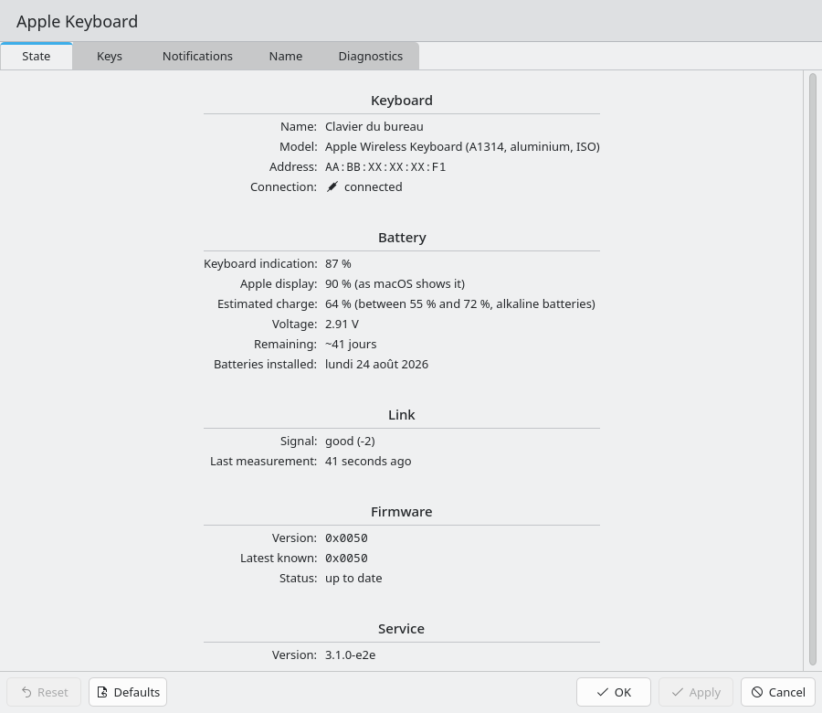
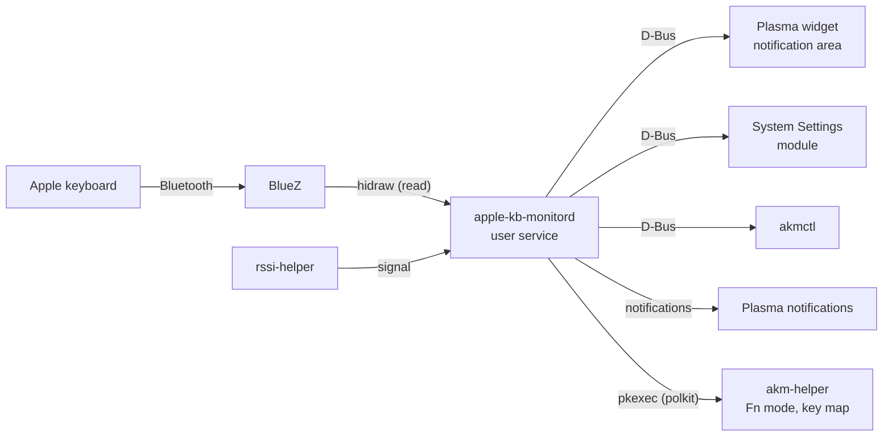

<h1 align="center">apple-kb-monitor</h1>

<p align="center">
  <b>Your old Apple Wireless Keyboard, finally at home on Linux.</b><br>
  Battery level you can trust, a warning before it dies, Fn keys that do what you want,<br>
  and a retro green-screen panel right in your KDE Plasma notification area.
</p>

<p align="center">
  <a href="https://github.com/litteulapi/apple-kb-monitor/actions/workflows/ci.yml"></a>
  <a href="https://github.com/litteulapi/apple-kb-monitor/actions/workflows/package.yml"></a>
  <a href="https://github.com/litteulapi/apple-kb-monitor/releases/latest"></a>
  <a href="LICENSE"></a>
  
  
  
</p>

<p align="center">
  
</p>

You have one of those aluminium Apple keyboards that run on AA batteries. On
Linux it types fine, but that's about it: the battery figure is vague, the
keyboard dies without warning in the middle of a sentence, F4 and Eject do
nothing, and when it refuses to reconnect you are on your own.

**apple-kb-monitor** fixes that. It talks to the keyboard the way macOS does
(reading only, gently, on the same schedule), and shows you what it learns
where you already look: the notification area, your notifications and System
Settings.

> Tested on the **Apple Wireless Keyboard A1314** (aluminium, two AA batteries). Other
> Apple Bluetooth keyboards are recognised but have not been tried on real
> hardware yet: reports are welcome.

## What you get

| | |
|---|---|
|  | **A panel one click away.** The keyboard icon sits in the notification area with its battery level. Click it: battery, voltage, estimated days left, signal quality, Caps Lock / Num Lock, firmware. Click again and it closes, like the volume panel. |
|  | **Warned before it dies.** Low and critical battery notifications (including the keyboard's own alarm), keyboard disconnected or switched off. They are regular Plasma notifications: choose sound, popup or silence per event in System Settings. |
|  | **Battery history.** 24 hours to 90 days of charge and voltage, an estimate of the days left based on your batteries (alkaline, NiMH, lithium), and it notices when you put in fresh ones. |
|  | **Fn keys your way.** Media keys first, or F1-F12 first: one click, no config file to edit. F4 (Launchpad) and Eject can be bound in KDE too. |
|  | **Signal quality.** See at a glance whether the keyboard is too far from the Bluetooth adapter, and reconnect it from the same tab. |
|  | **A doctor for "it won't reconnect".** Checks the adapter, the pairing, the permissions and the Bluetooth settings, says what is wrong in plain words, and repairs the link step by step. |

### In System Settings

*Input & Output → Keyboard → Apple Keyboard*: state, special keys, notifications,
keyboard name and diagnostics, in the place KDE users expect them. Notifications
are saved with Apply; the other changes happen when you click their own button,
and the system-wide ones (hid_apple parameters, key mapping) ask for the
administrator password.

<p align="center"></p>

### In a terminal

`akmctl` gives everything to scripts: status, live JSON, history, a terminal
chart, Waybar and Prometheus outputs, the diagnostic and the repair.

<p align="center"></p>

## Install, step by step

### 1. Before you start

- **Arch Linux or Manjaro** (x86_64) with **KDE Plasma 6**.
- **Bluetooth switched on**: the Bluetooth icon in the notification area is not greyed out.
- **The keyboard paired.** If it is not yet: open *System Settings → Bluetooth*,
  click *Pair a new device*, switch the keyboard on (button on its right side:
  the small green light blinks), select it, then **type on the keyboard the code
  shown on screen and press Enter**. It now types in any window.

### 2. Install the package

One line, from the latest release (the script checks the download's sha256,
installs it with pacman, then offers step 3):

```bash
curl -fsSL https://raw.githubusercontent.com/litteulapi/apple-kb-monitor/main/install.sh | bash
```

Prefer to do it by hand? Download the `.pkg.tar.zst` and its `.sha256` from the
[Releases page](https://github.com/litteulapi/apple-kb-monitor/releases), then:

```bash
sha256sum -c apple-kb-monitor-*.pkg.tar.zst.sha256
sudo pacman -U apple-kb-monitor-*.pkg.tar.zst
```

Or build it yourself (it compiles Rust and C++, give it a few minutes):

```bash
git clone https://github.com/litteulapi/apple-kb-monitor.git
cd apple-kb-monitor
makepkg -si
systemctl --user enable --now apple-kb-monitord.service apple-kb-monitor-shutdown.service apple-kb-monitor-selfcheck.timer
```

The last line enables the background service for your user (Arch packages enable no user unit by themselves); no group to join, no restart.

### 3. The keyboard icon

The keyboard icon is in the notification area, with the battery percentage
inside: nothing to set. Left click opens the panel shown above, right click
gives the menu (refresh, Fn mode, reconnect, settings…). If it sits in the
hidden part (the small arrow), right-click the arrow → *Configure System Tray…*
→ *Entries* → **ApiHub** → *Always shown*.

### 4. Check that everything works

```bash
akmctl doctor
```

Each line starts with `[ ok ]`, `[info]`, `[ !! ]` (to check) or `[ KO ]` (problem);
`[ !! ]` and `[ KO ]` lines say what to do. The last line is the verdict. `akmctl status` then shows the
battery, the signal and the Fn mode.

### 5. Uninstall

```bash
sudo pacman -R apple-kb-monitor
```

Your settings and battery history stay in `~/.config/apple-kb-monitor/` and
`~/.local/state/apple-kb-monitor/`; delete them if you do not want them back.

Details (what the package installs, upgrades, permissions): [docs/INSTALL.md](docs/INSTALL.md).

## It doesn't work?

| What you see | What to do |
|---|---|
| No keyboard icon at all | `systemctl --user status apple-kb-monitord.service`; if it is not running: `systemctl --user start apple-kb-monitord.service` |
| No keyboard icon after the install | Plasma reads new widgets at start: log out and in, or `systemctl --user restart plasma-plasmashell.service` |
| Signal says "not measured" | The rssi-helper is missing (reinstall the package), or the adapter gives no value for this link (bring the keyboard closer, reconnect it); `akmctl doctor` names the cause |
| The keyboard does not come back after a pause | Press a key and wait a few seconds. Still nothing: switch it off and on (the light blinks), then `akmctl repair` |
| The battery figure stays the same for days | Normal: the keyboard only updates its own figure when it reconnects. The estimate from the voltage moves sooner |
| F4 or Eject do nothing | `akmctl keymap kde-apply` binds F4 to the application launcher in KDE (it never replaces a shortcut you already set); Eject: [docs/KEYS.md](docs/KEYS.md) §5 |

Still stuck? `akmctl doctor` and [docs/TROUBLESHOOTING.md](docs/TROUBLESHOOTING.md),
then open an [issue](https://github.com/litteulapi/apple-kb-monitor/issues) with the
output of `akmctl doctor`.

## For the curious: under the hood

The kernel only gives these keyboards a rough percentage. The interesting
data hides in undocumented vendor reports of the keyboard's Bluetooth chip:
battery voltage in millivolts, the keyboard's own low-battery alarm, firmware
version, the name stored inside the keyboard. Finding and reading them safely
took a fair amount of reverse engineering of Apple's own driver; the
measurements are in [docs/](docs/INDEX.md).

- A background **user service** in Rust owns the keyboard and reads it exactly
  like macOS does: same reports, same schedule, same "stop everything after
  three silences" safety. It writes nothing to the keyboard but three named
  operations: the shutdown notice macOS also sends, and two you have to
  confirm (forget the keyboard, store a new name in it).
- Everything else (the Plasma widget, the System Settings module, `akmctl`,
  notifications) talks to it over **D-Bus** (`com.agenceapi.AppleKbMonitor1`),
  so you can script it too.
- **One privileged helper**, through polkit, does the few things that need root:
  Fn mode and `hid_apple` parameters, key mapping, sleep bytes, doctor fixes.
  `rssi-helper` carries a file capability for the signal reading (Bluetooth
  management socket, relative to the adapter's ideal range, not a power
  level).



Where to read next: [ARCHITECTURE](docs/ARCHITECTURE.md),
[CONFIGURATION](docs/CONFIGURATION.md), [FEATURES](docs/FEATURES.md),
[KEYS](docs/KEYS.md) (keys), [KCM](docs/KCM.md), [NOTIFICATIONS](docs/NOTIFICATIONS.md),
[APPLE-PARITY](docs/APPLE-PARITY.md) (how it matches macOS), [FIRMWARE](docs/FIRMWARE.md),
the hardware reference [HARDWARE-HID-REPORTS](docs/HARDWARE-HID-REPORTS.md), and the
full [index](docs/INDEX.md). Changes: [CHANGELOG.md](CHANGELOG.md).

## Translations

The widget, the System Settings module, the notifications and `akmctl` speak
your desktop language. 19 languages besides English: Chinese (Simplified),
Czech, Danish, Dutch, Finnish, French, German, Italian, Japanese, Korean,
Norwegian Bokmål, Polish, Portuguese, Portuguese (Brazil), Russian, Spanish,
Swedish, Turkish and Ukrainian. Missing your language, or a wording that
sounds off? The catalogs are plain gettext `.po` files under `po/`,
`plasma/po/` and `kcm/po/`: see [CONTRIBUTING.md](CONTRIBUTING.md#translations).

## Contributing

Bug reports, translations and pull requests are welcome. Start with
[CONTRIBUTING.md](CONTRIBUTING.md) (build, tests, commit style); a bug report
needs the output of `akmctl doctor`. Security issues: please follow
[SECURITY.md](SECURITY.md) rather than opening a public issue. Everyone
taking part agrees to the [Code of Conduct](CODE_OF_CONDUCT.md).

## License

[GPL-2.0-or-later](LICENSE). The VT323 font of the panel is under the SIL Open Font License 1.1.
