# Direction artistique « Pip-Boy » de la fenêtre

La fenêtre `apihub-app` est dessinée comme l'écran d'un appareil : un terminal
RobCo / Pip-Boy 3000 à phosphore vert. Ce document fixe les principes, la
palette, la grille et les composants, montre les captures de référence et
indique où se trouve, dans la nouvelle fenêtre, chaque fonction de l'ancienne.

Sources : `apihub-app/src/theme.rs` (palette, police, style, primitives),
`shell.rs` (en-tête, onglets, alertes, barre d'état, clavier), `tab_stat.rs`,
`tab_radio.rs`, `tab_keys.rs`, `tab_data.rs` + `history_chart.rs`,
`tab_diag.rs`, `actions.rs` (actions hors du fil d'interface), `settings.rs`
(réglage `[ui]`), `view.rs` (textes et calculs purs).

## 1. Principes

1. **Un appareil, pas une application recolorée.** Cadre d'écran, en-tête de
   terminal, onglets en capitales dont l'actif est encadré, barre d'état
   permanente : la coque ne change jamais, seul l'onglet change.
2. **Trois besoins, dans cet ordre.** Voir d'un coup d'œil (STAT), agir
   (STAT, RADIO, KEYS, DATA), comprendre (DATA, DIAG).
3. **Une composition par onglet.** STAT : chiffre géant et clavier dessiné ;
   RADIO : échelle graduée à aiguille ; KEYS : commutateur et capuchons de
   touches ; DATA : tracé cathodique ; DIAG : journal de terminal.
4. **Rien n'est tronqué.** Une valeur trop longue passe sous son libellé et
   se replie ; une valeur de cellule réduit sa taille puis se replie.
5. **Jamais de champ vide.** Une valeur non lue s'écrit `---`, une heure
   `--:--:--`, une adresse `--:--:--:--:--:--`.
6. **Client mince.** La fenêtre ne lit et n'agit que par le démon (D-Bus) ;
   elle n'écrit jamais dans le clavier. Les deux opérations qui touchent le
   clavier ou l'appairage sont des **renvois vers une commande** que
   l'utilisateur lance lui-même (`akmctl rename --device-name`,
   `akmctl repair`).
7. **Effets statiques.** Scanlines, vignette et halo sont des formes dessinées
   une fois par image avec le painter d'egui : aucune animation, aucune
   repeinture ajoutée (cadence inchangée : sur évènement, sinon 1 s ; `vsync`
   désactivé conservé, #231).

## 2. Palette

Palette canonique du thème Pip-Boy de l'agence, sans autre couleur
(`theme.rs`, testée par `palette_is_the_canonical_one`).

| Constante | Hex | Rôle dans la fenêtre |
|---|---|---|
| `PHOSPHOR` | `#15FF00` | texte principal, valeurs, élément actif, halo |
| `GREEN_MID` | `#0acc00` | libellés, texte secondaire, valeur inconnue |
| `GREEN_DIM` | `#0a9a00` | décor seulement (touches du clavier dessiné) |
| `GREEN_FRAME` | `#0a7a00` | bordures, filets, blocs éteints, pointillés |
| `BG` | `#021206` | fond CRT, encre de la vidéo inverse |
| `BG_PANEL` | `#04180A` | panneaux, centre du dégradé |
| `AMBER` | `#ffb641` | avertissement (piles basses, démon absent, en cours) |
| `RED` | `#ff5a3c` | erreur, alerte (hors ligne, piles critiques, échec) |

Le vert sombre et le vert cadre ne portent jamais un texte à lire. Contraste
de chaque encre de texte sur les deux fonds : supérieur à 4,5 (test
`text_colours_are_readable_on_the_crt`).

Niveaux : bon = phosphore, avertissement = ambre, mauvais = rouge, inconnu =
vert moyen.

## 3. Police

**VT323** (The VT323 Project Authors, SIL Open Font License 1.1), embarquée
par `include_bytes!` depuis `apihub-app/assets/fonts/VT323-Regular.ttf`,
installée en tête des familles proportionnelle et monospace d'egui ; les
polices d'egui restent en repli. La licence (`assets/fonts/OFL.txt`) est
installée par le paquet dans `/usr/share/licenses/apple-kb-monitor/OFL.txt`.

Couverture vérifiée par test (`font_covers_french_and_falls_back_for_the_rest`) :
VT323 a les accents français, `%`, `« » ’ … — – · ≈ −` et l'espace insécable.
Ni VT323 ni les polices de repli n'ont les flèches, les caractères de boîte,
les blocs `▰▱█` ou l'espace fine insécable. En conséquence :

- cadres, filets, jauges, barres de signal, capuchons de touches et aiguilles
  sont **dessinés au painter**, jamais écrits en glyphes ;
- `theme::glyphs` remplace l'espace fine insécable par une espace insécable,
  `→` par `>` et `↔` par `<>` ; le test parcourt tout le catalogue `fr.po` ;
- le tilde de VT323 est un petit signe surélevé qui se lit comme une lettre
  parasite : devant un nombre (« ~41 jours ») il devient `≈`, que VT323
  dessine bien ; un chemin (`~/.config`) garde son tilde.

## 4. Grille

| Constante | Valeur | Usage |
|---|---|---|
| `SMALL` / `BODY` / `TITLE` / `VALUE` | 18 / 20 / 24 / 30 px | plus petit texte, texte courant, titre et onglets, valeurs clés |
| `HERO_NARROW` / `HERO` | 104 / 132 px (jusqu'à 260) | pourcentage des piles |
| `GUTTER` | 14 px | marge entre le bord de la fenêtre et le contenu |
| `BEZEL_INSET` | 5 px | position du cadre d'écran |
| `GAP` | 8 px | espace entre deux blocs |
| `TARGET` | 30 px | hauteur minimale de toute cible cliquable (≥ 28) |
| `ROW` | 24 px | hauteur d'une ligne clé / valeur |
| `NARROW` | 640 px | sous cette largeur de contenu : une colonne |
| `MAX_CONTENT` | 1180 px | au-delà, les onglets restent centrés |
| `SCANLINE_PITCH` | 3 px | pas des scanlines |

VT323 est à chasse fixe : une lettre avance de 0,4 × la taille. À 420 px de
large il reste 392 px de contenu, soit 49 lettres en texte courant. Tailles
prévues : de 420×700 à 1920×1200 (taille par défaut 900×700, minimum 420×400).

## 5. Composants (`theme.rs`)

| Primitive | Rendu |
|---|---|
| `Theme::backdrop` | fond CRT, dégradé du tube, cadre d'écran et quatre équerres phosphore |
| `Theme::overlay` | scanlines et vignette sur toute la fenêtre (couche la plus haute) |
| `Theme::glow` / `glow_label` | texte à halo phosphore (texte simple si les effets sont coupés) |
| `Theme::panel` | boîte dont le titre s'inscrit dans le filet du haut |
| `Theme::kv` | ligne `LIBELLÉ ........ valeur`, la valeur passe dessous si elle ne tient pas |
| `Theme::cell` | cellule de la bande de statistiques : petit libellé, grande valeur |
| `Theme::alert` | ligne d'alerte : barre de couleur, `[!]`, texte replié |
| `segments` / `paint_segments` | jauge en blocs inclinés (`▰▰▰▱▱`) |
| `signal_bars` | quatre barres de signal croissantes |
| `choice` | position d'un sélecteur, vidéo inverse quand elle est choisie |
| `action` | bouton de terminal `[ LIBELLÉ ]` |
| `rule` / `double_rule` | filet à butées, filet double de l'en-tête |
| `split` | deux blocs côte à côte |
| `scroll_body` | zone défilante d'un onglet (position propre à chaque onglet) |

Fonctions pures testées : `segment_count`, `lit_segments`, `fit_size`,
`kv_inline`, `scanlines`, `glyphs`, `caps` ; côté coque `flow_rows`,
`nav_for`, `Tab` ; côté onglets `wide_layout`, `key_rects`, `scale_x`,
`columns`, `media_first`, `hero_text`.

## 6. La coque

- **En-tête** : `ROBCO INDUSTRIES (TM) TERMLINK PROTOCOL` et la version, puis
  `> MONITEUR DE CLAVIER APPLE` et l'état de la liaison (`EN LIGNE`,
  `HORS LIGNE`, `SANS DONNÉES`) avec son voyant ; filet double.
- **Onglets** : `1 STAT`, `2 RADIO`, `3 KEYS`, `4 DATA`, `5 DIAG`, identiques
  en français et en anglais ; l'actif est encadré et ouvre le filet.
- **Alertes** (sous les onglets, sur tous les onglets), de la plus urgente à
  la moins urgente : démon absent, erreur de lecture, en attente de données,
  clavier déconnecté, piles basses ou critiques. Rien quand tout va bien.
- **Barre d'état** permanente : nom du clavier, adresse masquée
  (`AA:BB:XX:XX:XX:F1`), firmware, heure de la dernière lecture. Les
  éléments passent à la ligne quand la largeur manque.

### Clavier

| Touche | Effet |
|---|---|
| `1` à `5` | ouvre l'onglet (touche physique : sans Maj sur un clavier AZERTY) |
| `←` `→` | onglet précédent / suivant quand aucun contrôle n'a le focus |
| `↑` `↓` `Page préc.` `Page suiv.` | fait défiler l'onglet quand aucun contrôle n'a le focus |
| `Tab` / `Maj+Tab` | parcourt les onglets puis les contrôles |
| `Entrée` / `Espace` | active le contrôle qui a le focus |
| `Échap` | quitte le contrôle qui a le focus, sinon revient à STAT |
| `F5` | relit ce que montre l'onglet (historique, table des touches, mode Fn, diagnostic) |

Dans un champ de saisie, les touches vont au champ.

## 7. Les onglets

- **STAT** : pourcentage géant coloré selon le niveau, jauge en blocs, origine
  du chiffre ; clavier dessiné (tube des piles rempli au niveau, touche de
  verrouillage allumée, plaque `HORS LIGNE`) ; bande de quatre cellules :
  état selon les seuils du clavier (`OK`, `BAS`, `CRITIQUE`, `VIDE`), tension,
  autonomie, signal ; actions : reconnecter, basculer le mode Fn, renommer.
  En fenêtre étroite l'ordre devient piles, cellules, actions (le tout sur
  le premier écran en 420×700), puis le clavier dessiné, atteint par
  défilement (molette, flèches, pages, ou `Tab` qui suit le focus).
- **RADIO** : qualité du signal en toutes lettres et en barres, échelle en dB
  relatifs avec ses zones faible / bon / excellent et une aiguille ; faits de
  la liaison ; reconnexion par le démon, et renvoi vers `akmctl repair`.
- **KEYS** : commutateur du mode Fn (multimédia d'abord / F1-F12 d'abord),
  table des touches spéciales (capuchon, légende, code et action KDE sans et
  avec Fn, note), éditeur du mapping manuel.
- **DATA** : historique 24 h / 7 / 30 / 90 jours ; piles (tension placée sur
  l'échelle des seuils du clavier, estimation, affichage Apple, chimie, âge
  de la lecture, autonomie) ; appareil et renommage (alias de ce poste ; le
  nom stocké dans le clavier renvoie vers `akmctl rename --device-name`) ;
  firmware et rapports bruts.
- **DIAG** : bouton de vérification, compte des contrôles réussis, un bloc de
  jauge par contrôle, puis le journal `[ OK ]` / `[ÉCHEC]` ; le détail d'un
  contrôle en échec (qui contient le correctif) est écrit en phosphore.

## 8. Réglage

```toml
[ui]
crt_effects = true   # scanlines, vignette et halo ; false les retire
```

Lu une fois au lancement dans le `config.toml` du démon
(`akm_core::config::default_path()`), en lecture seule ; défaut `true`.
`akm-core` n'a pas été modifié : la section est lue par `settings.rs`. Tant
qu'`akm-core` ne connaît pas `[ui]`, le démon signale cette clé dans son
journal (`unknown or mistyped key [ui] crt_effects`) sans autre effet.

## 9. Captures

Produites par le scénario `screens` de `tests/e2e` (rendu réel sous Xvfb,
faux démon à données fixes, interface en français). Les références de
comparaison sont dans `tests/e2e/refs/` ; les copies ci-dessous sont réduites
à 128 couleurs pour alléger le dépôt.

| Onglet | 900×700 | 420×700 |
|---|---|---|
| STAT | 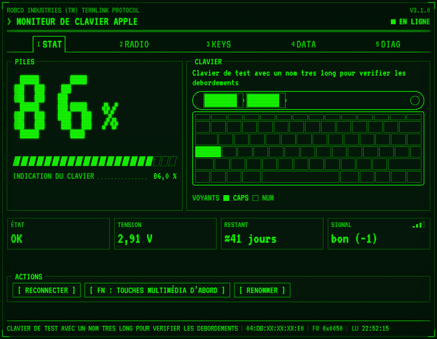 | 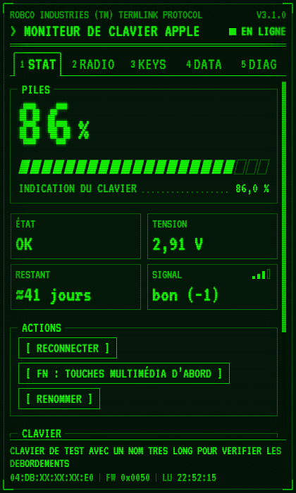 |
| RADIO | 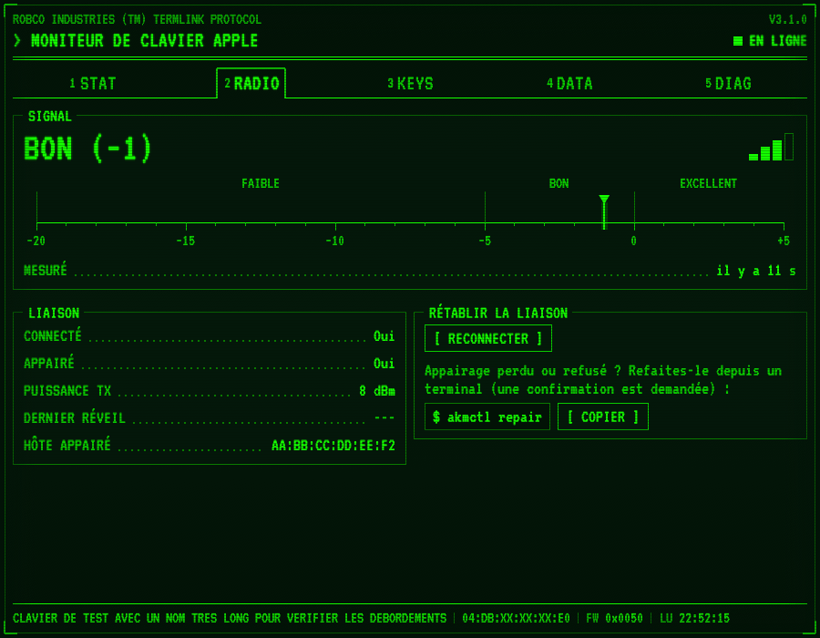 | 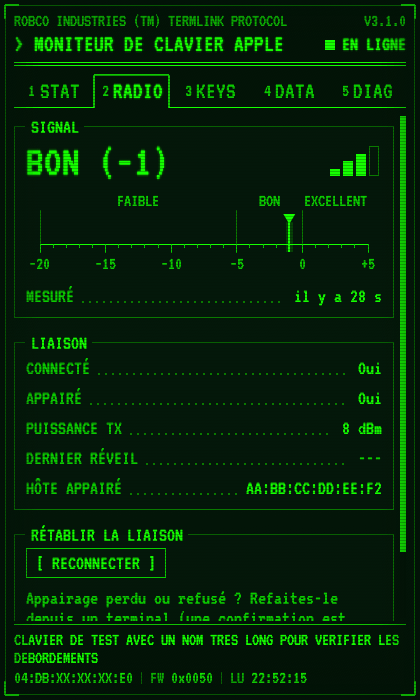 |
| KEYS | 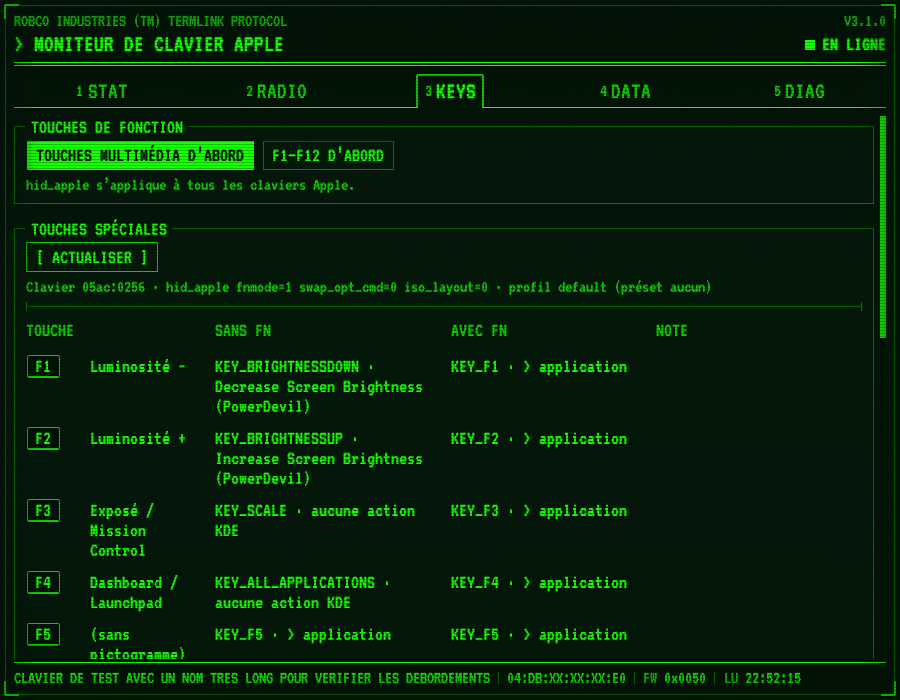 | 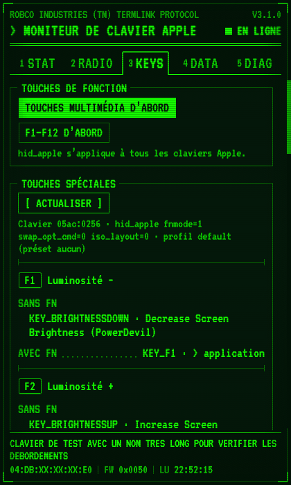 |
| DATA | 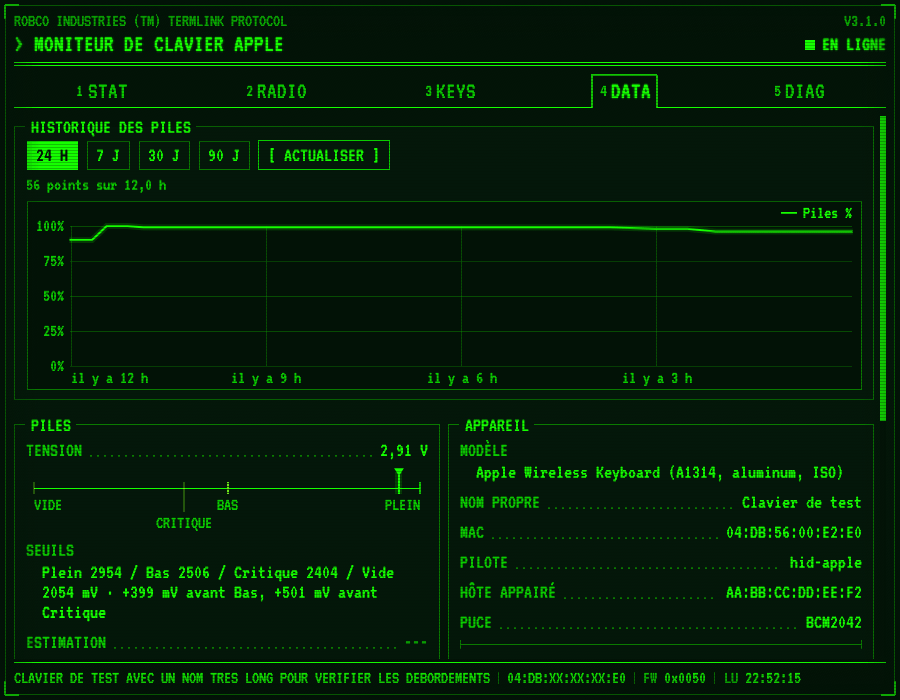 | 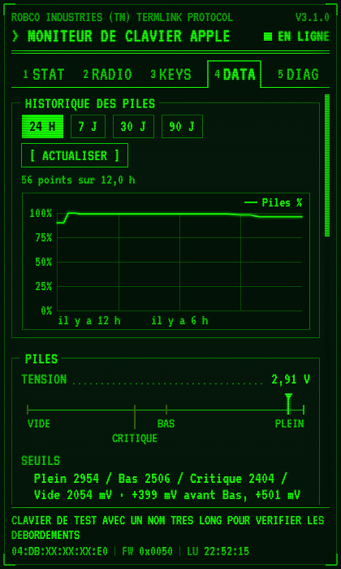 |
| DIAG | 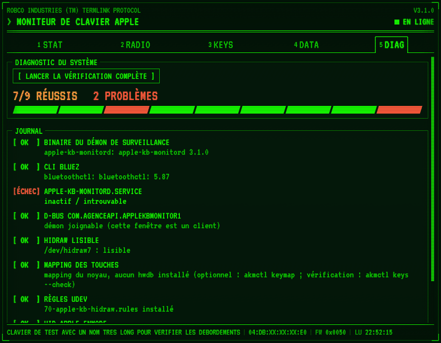 | 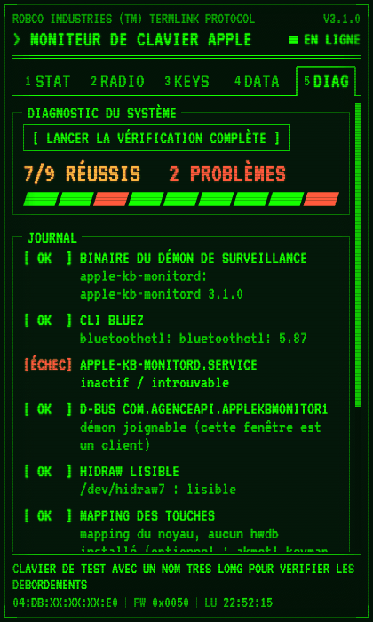 |

| État | Captures |
|---|---|
| Clavier déconnecté, piles basses | 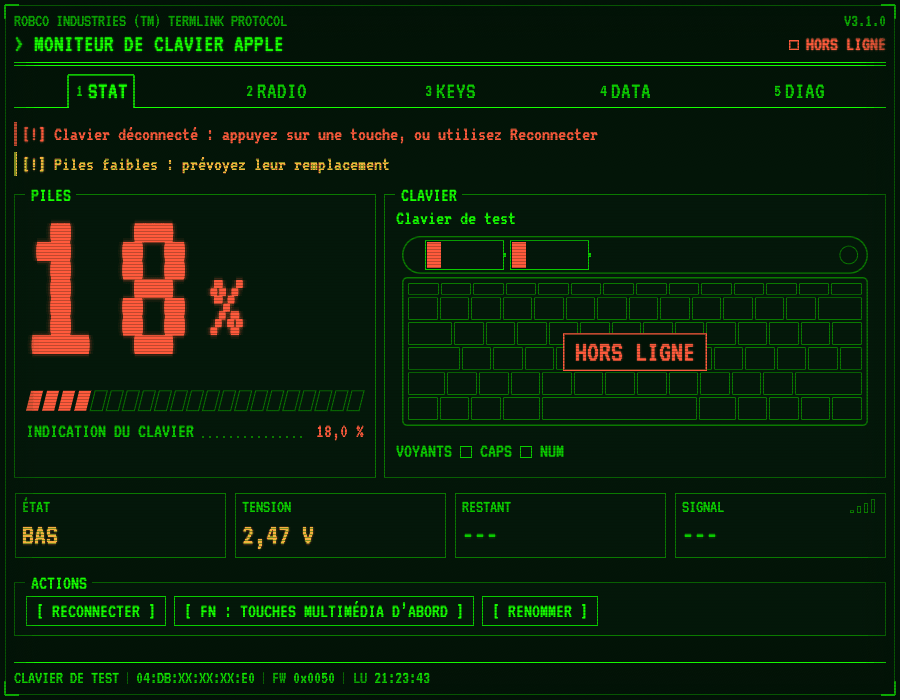 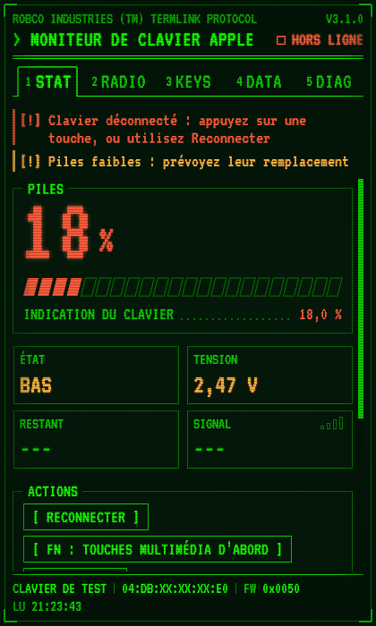 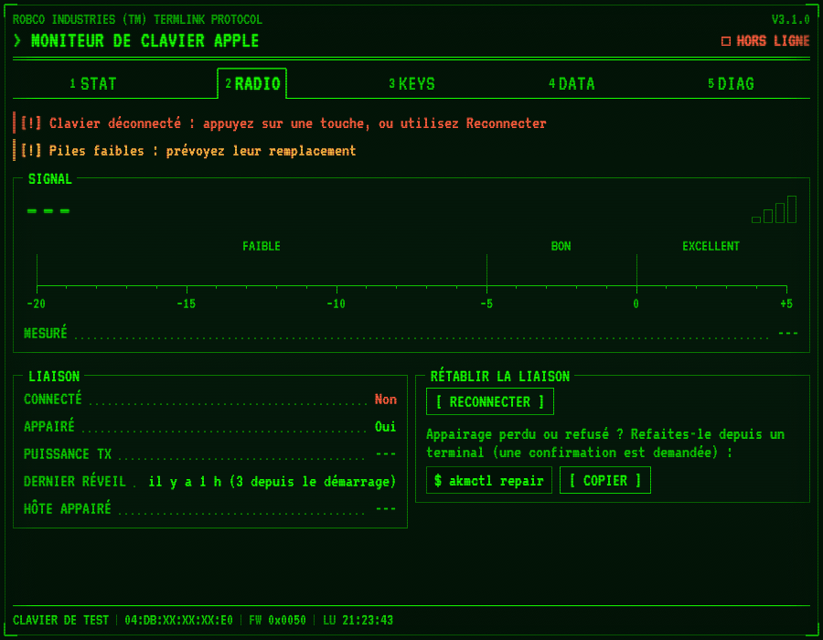 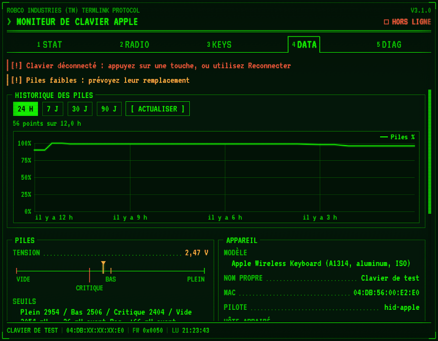 |
| Démon absent (lecture locale) | 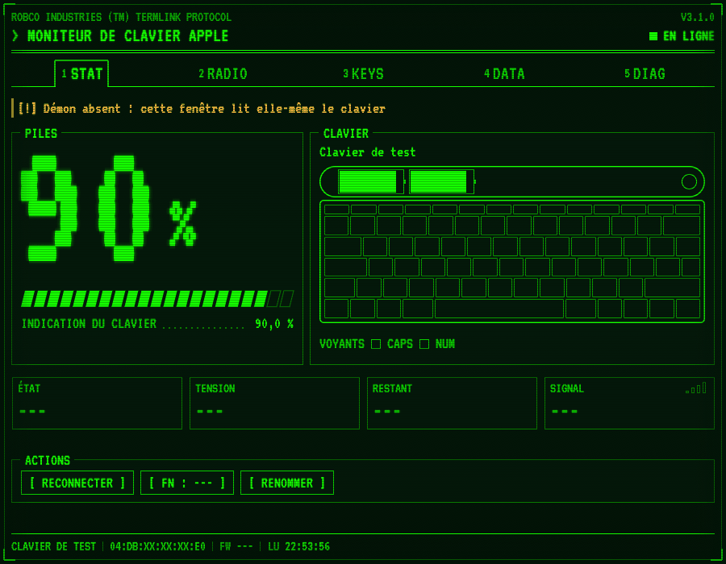 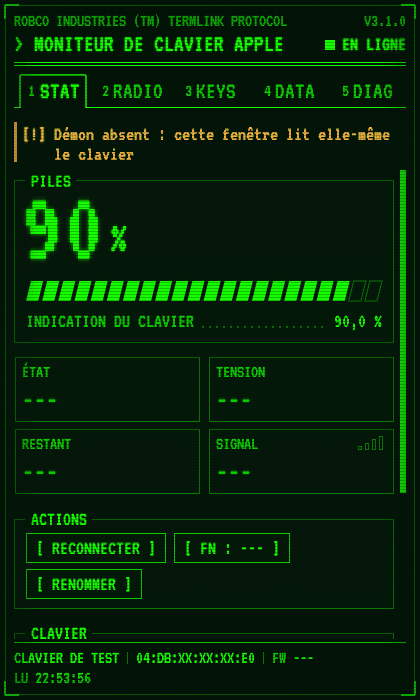 |
| `crt_effects = false` | 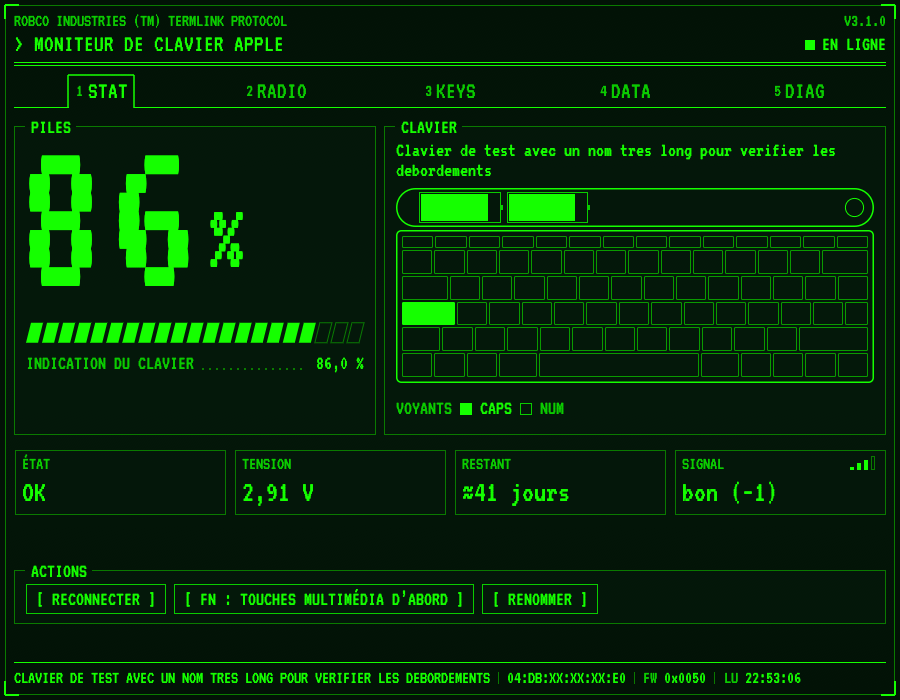 |

Régénérer : `tests/e2e/run.sh --only screens --update-refs`.

## 10. Fonctions de l'ancienne fenêtre et leur emplacement

L'ancienne fenêtre avait trois onglets : Clavier, Touches, Diag.

| Ancienne fonction | Nouvel emplacement |
|---|---|
| Bandeau d'erreur de lecture (`kb_error`) | bloc d'alertes, tous les onglets |
| « En attente des données du clavier… » | bloc d'alertes ; les valeurs s'écrivent `---` |
| Pourcentage coloré selon le niveau | STAT, panneau PILES |
| Origine du pourcentage (indication / estimation / inconnu) | STAT, sous la jauge |
| Barre de progression et pourcentage à une décimale | STAT, jauge en blocs et valeur précise |
| Tension colorée | STAT, cellule TENSION ; DATA, PILES |
| Estimation selon la chimie, « piles neuves » | DATA, PILES |
| Affichage Apple | DATA, PILES |
| Seuils du clavier et marges | DATA, PILES (échelle et texte) ; STAT, cellule ÉTAT |
| Chimie des piles | DATA, PILES |
| Âge de la lecture | DATA, PILES ; heure dans la barre d'état |
| Autonomie restante | STAT, cellule RESTANT ; DATA, PILES |
| Voyants CAPS / NUM | STAT, panneau CLAVIER (voyants et touche allumée) |
| Signal en mots et barres | STAT, cellule SIGNAL ; RADIO, échelle |
| Âge de la mesure du signal | RADIO, SIGNAL |
| Puissance TX | RADIO, LIAISON |
| Connecté oui / non | RADIO, LIAISON ; en-tête ; clavier dessiné |
| Appairé | RADIO, LIAISON |
| Dernier réveil | RADIO, LIAISON |
| Modèle, nom propre, MAC, pilote, hôte appairé, puce | DATA, APPAREIL (hôte appairé aussi dans RADIO) |
| Champ de nom, Renommer, Réinitialiser, Entrée, message | DATA, APPAREIL ; bouton Renommer de STAT |
| Ligne firmware colorée, source et date de table, « pas encore lu » | DATA, FIRMWARE ; version dans la barre d'état |
| Rapports bruts, lecture incomplète | DATA, FIRMWARE |
| Historique : période, Actualiser, chargement, note, résumé, tracé piles et tension, légende, messages sans donnée | DATA, HISTORIQUE DES PILES |
| Touches : Actualiser, chargement, démon injoignable | KEYS, TOUCHES SPÉCIALES |
| Touches : ligne clavier / paramètres / profil / non appliqué | KEYS, TOUCHES SPÉCIALES |
| Touches : KDE injoignable | KEYS, alerte dans le panneau |
| Touches : table (touche, remappée, légende, codes, action KDE, note) | KEYS, table (blocs par touche en fenêtre étroite) |
| Touches : remapper, rétablir, préset, appliquer, revenir au noyau, statut | KEYS, MAPPING MANUEL |
| Touches : « hid_apple s'applique à tous les claviers Apple » | KEYS, TOUCHES DE FONCTION |
| Diag : lancer, en cours, invites, n/n réussis, problèmes, liste | DIAG |
| Instance unique, mise au premier plan, fermeture = fin du processus | inchangé (`main.rs`, `instance.rs`) |
| Battement d'interface, statistiques d'images, `vsync` désactivé | inchangé |
| Deux colonnes à partir de 660 px | une colonne sous 640 px de contenu |
| Suivi du thème clair / sombre et de la couleur d'accent du bureau | **retiré** : la palette est imposée |

Ajouts : reconnexion (`Link.Reconnect`), bascule du mode Fn dans la fenêtre
(`Device.SetFnMode`, déjà offerte par `apihub-app --toggle-fn`), état des
piles selon les seuils du clavier, alertes piles basses / critiques et démon
absent, renvois vers `akmctl repair` et `akmctl rename --device-name`, barre
d'état, navigation au clavier, réglage `crt_effects`.

## 11. Limites connues

- `ROBCO INDUSTRIES (TM) TERMLINK PROTOCOL` reprend la formule d'un univers de
  fiction sous marque : à remplacer par une ligne propre si le paquet est
  diffusé hors de l'agence (constante `shell::TERMINAL_LINE`).
- Le champ de nom est un champ d'une ligne : un alias plus long que le champ
  y défile ; il reste lisible en entier dans la barre d'état.
- Les textes venus du démon (notes de la table des touches, titres des
  présets) ne sont pas traduits par la fenêtre.
- Les intitulés d'onglets ne sont pas traduits, par choix.
