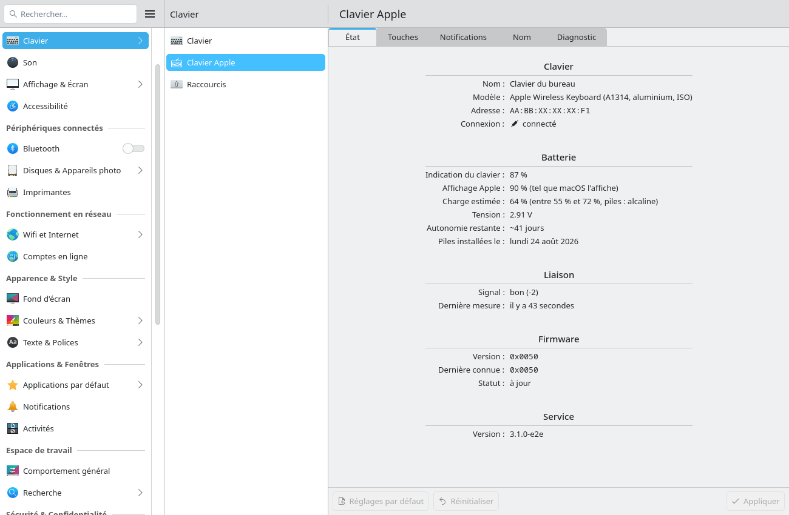
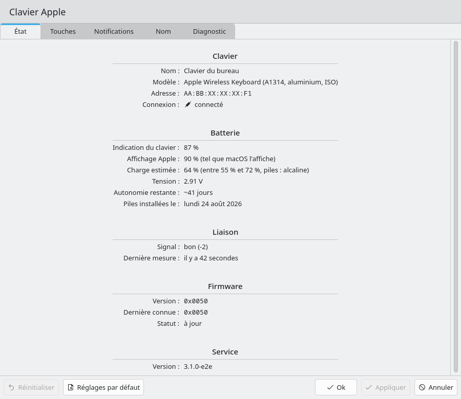
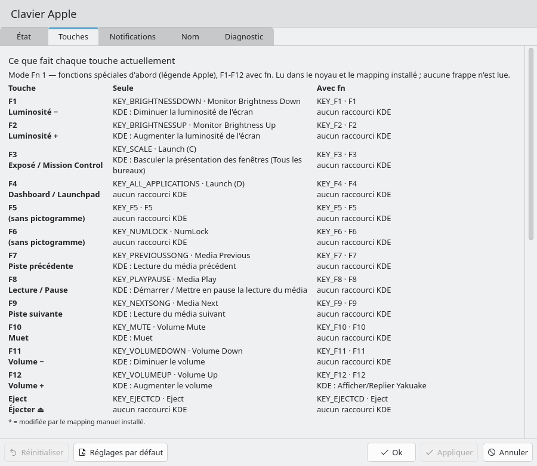
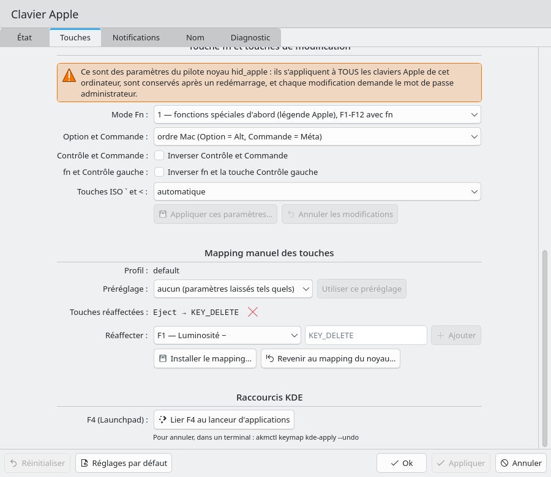
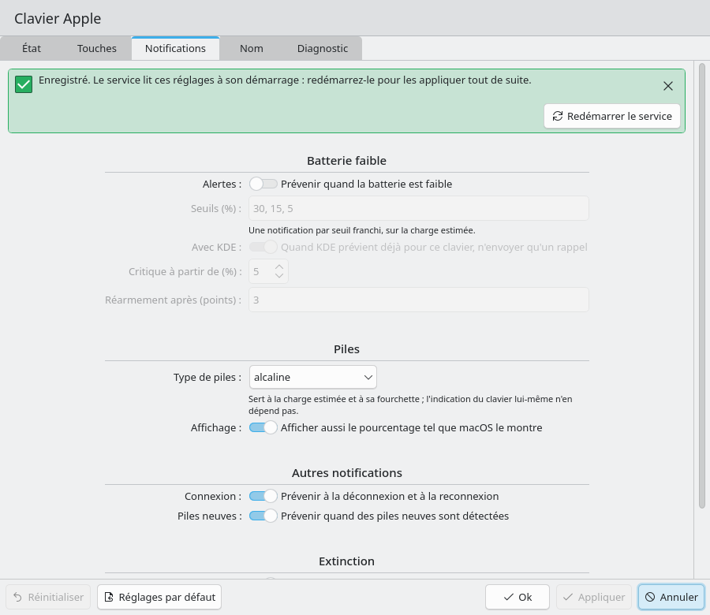
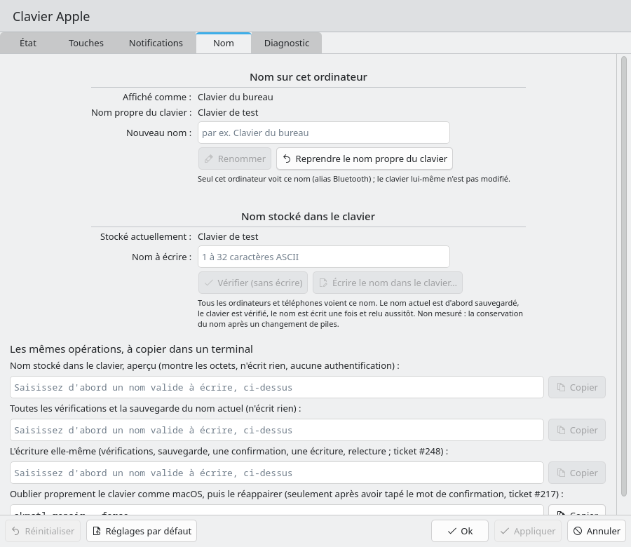
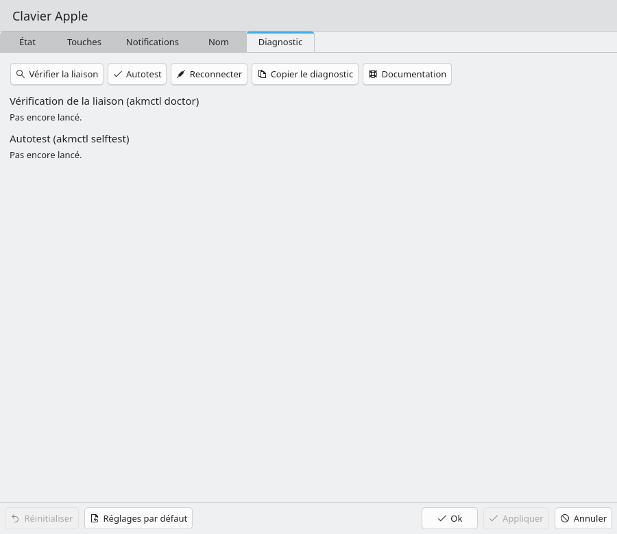
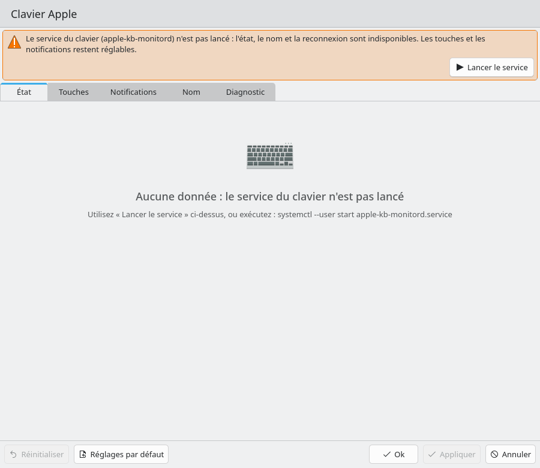
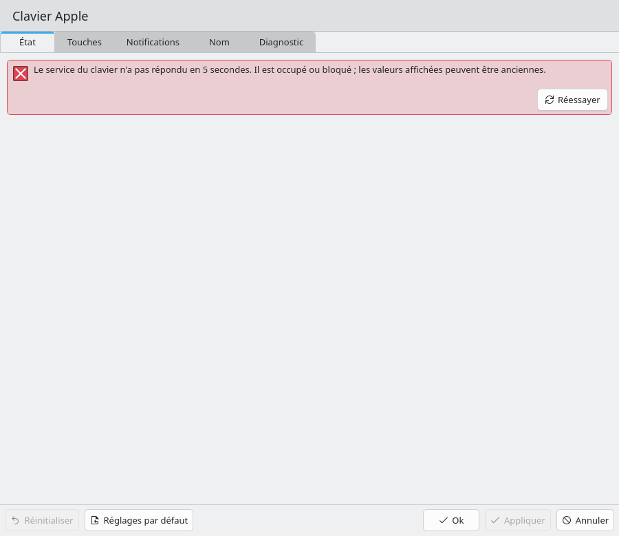
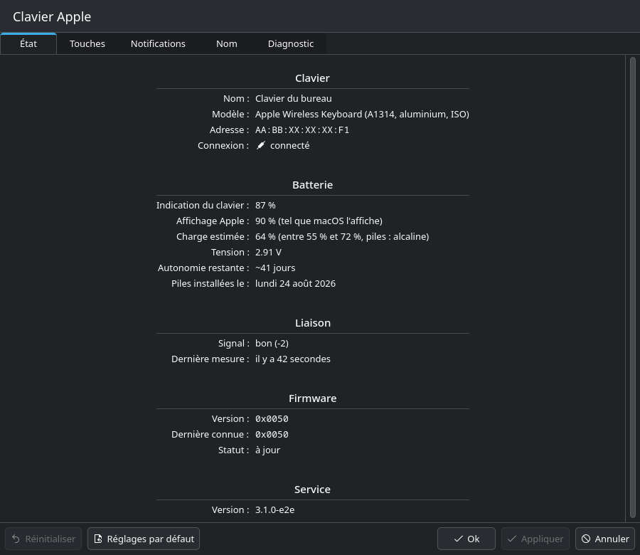

# Module des Paramètres système « Clavier Apple » (KCM)

Issue : #250 (suite de #111, F31). Demande du gérant : « je veux tout correctement lié avec KDE Linux ».

Le module apparaît dans **Paramètres système → Entrées et sorties → Clavier → Clavier Apple**
(catégorie KDE `keyboard`, à côté de « Clavier » et « Raccourcis »). La recherche des
Paramètres système le trouve avec « clavier apple », « batterie », « fn », « touches »,
« piles », « éjecter », « renommer »… En ligne de commande :

```sh
kcmshell6 kcm_applekeyboard                 # fenêtre seule
kcmshell6 kcm_applekeyboard --args keys     # ouvre l'onglet Touches (state, keys, notifications, name, diagnostics)
systemsettings kcm_applekeyboard            # dans les Paramètres système
```



## Pourquoi un petit plugin C++ (et pas un paquet QML pur)

Vérifié sur le poste (Plasma 6.7.5, KF 6.30, Qt 6.11) le 2026-10-01 :

* `kpackagetool6 --list-types` ne connaît aucune structure de paquet KCM (seulement
  `KPackage/Generic`, `KPackage/GenericQML`, `Plasma/*`, `KWin/*`, `KSysguard/SensorFace`) et
  `/usr/share/kpackage/kcms` n'existe pas : le format « KPackage KCM » de Plasma 5 a disparu ;
* les 103 modules de `kcmshell6 --list` sont tous des plugins `.so` de
  `/usr/lib/qt6/plugins/plasma/kcms/systemsettings/` ;
* `KQuickConfigModuleLoader` (libKF6KCMUtils) charge un module par `KPluginFactory`, puis son
  QML depuis les ressources du plugin (`qrc:/kcm/<id>/main.qml`) ; la macro CMake
  `kcmutils_add_qml_kcm` (KF ≥ 6.0) compile `ui/` dans ces ressources.

Donc un plugin est indispensable. Il est réduit au minimum : `kcm/src/kcm.cpp` (la classe
`KQuickConfigModule`, 66 lignes : cycle charger / appliquer / défauts) et `kcm/src/bridge.cpp`
(les E/S asynchrones, voir plus bas). Toute l'interface est en QML (`kcm/ui/`).

Dépendances de construction : `cmake`, `extra-cmake-modules` ; à l'exécution : `qt6-base`,
`qt6-declarative`, `kcmutils`, `ki18n`, `kcoreaddons`, `kirigami` (déjà présents sur tout
Plasma 6). Le PKGBUILD les déclare et installe :

| Fichier installé | Rôle |
|---|---|
| `/usr/lib/qt6/plugins/plasma/kcms/systemsettings/kcm_applekeyboard.so` | plugin + pages QML |
| `/usr/share/applications/kcm_applekeyboard.desktop` | généré par kcmutils (lanceur `NoDisplay`, recherche KRunner) |
| `/usr/share/locale/fr/LC_MESSAGES/kcm_applekeyboard.mo` | traduction française |
| `/usr/share/doc/apple-kb-monitor/KCM.md` | ce document |

Construction seule (sans paquet) :

```sh
cmake -S kcm -B /tmp/kcm-build -DCMAKE_INSTALL_PREFIX=/usr -DKDE_INSTALL_USE_QT_SYS_PATHS=ON
cmake --build /tmp/kcm-build
```

## Contenu

| Onglet | Ce qu'il montre / fait | Source |
|---|---|---|
| **État** | nom (alias), modèle, adresse, connexion ; batterie : indication du clavier, affichage Apple, charge estimée avec fourchette et chimie, tension, autonomie, date des piles ; signal (qualité + écart en dB), âge de la dernière mesure (mis à jour chaque seconde sans relire), firmware (version, dernière connue, statut), version du démon | D-Bus `GetState` (JSON schéma 1), propriété `DaemonVersion`, signal `StateChanged` |
| **Touches** | table effective F1-F12 / Éjecter pour le mode Fn courant (code evdev, touche Qt, action KDE liée) ; mode Fn 0-4, `swap_opt_cmd`, `swap_ctrl_cmd`, `swap_fn_leftctrl`, `iso_layout` avec l'avertissement « TOUS les claviers Apple » ; mapping manuel (préréglages apple / fkeys / linux-pc, ajout et retrait de touches, installation, retour au noyau) ; « Lier F4 au lanceur d'applications » | `akmctl keys --json` (avec actions KDE) et D-Bus `.Keymap.KeyTable` en parallèle ; `.Keymap.Keymap/SetKey/SetPreset/Apply/Reset` (sinon `akmctl keymap …`) ; `akmctl set param NOM VALEUR --persist` ; `akmctl keymap kde-apply` |
| **Notifications** | alertes de batterie (activées, seuils, critique, réarmement, un seul rappel quand PowerDevil prévient déjà), chimie des piles, affichage Apple, notifications de connexion et de piles neuves, **WillShutdown** ; valeurs montrées telles que le fichier les écrit, bornes et types du démon (seuils 1-99, critique 0-99, réarmement décimal 1-20), avertissement pour une valeur que le démon ne prend pas telle quelle | `~/.config/apple-kb-monitor/config.toml`, enregistré par le bouton **Appliquer** des Paramètres système |
| **Nom** | alias sur cet ordinateur (renommer, reprendre le nom propre) ; nom stocké dans le clavier : affiché, et **écrit** par « Écrire le nom dans le clavier… » (boîte de confirmation « Écrire « X » dans la mémoire du clavier ? », puis `akmctl rename --device-name=<nom> --yes`) ; « Vérifier (sans écrire) » lance la même commande avec `--check` ; le résultat s'affiche dans la page ; l'oubli propre reste une commande à copier (`akmctl repair --force`) | D-Bus `SetAlias(mac, nom)`, `keyboard.device.name_on_keyboard` de `GetState`, `akmctl` par `QProcess` (liste d'arguments, jamais de shell, 90 s au plus) |
| **Diagnostic** | `akmctl doctor --json` (verdict + constats), `akmctl selftest --json --no-save`, « Reconnecter », « Copier le diagnostic » (état + table + résultats, pour un ticket), lien vers TROUBLESHOOTING.md | `akmctl`, D-Bus `.Link.Reconnect` |








### Écritures et authentification

Aucune écriture sans clic explicite. **Une seule écriture va dans le clavier lui-même** : le nom
stocké, par l'onglet Nom (ligne « Nom dans le clavier » ci-dessous).

| Action | Chemin | Authentification |
|---|---|---|
| Paramètres `hid_apple` (mode Fn compris) | `akmctl set param … --persist` → `pkexec akm-helper` | action polkit existante `com.agenceapi.AppleKbMonitor.set-fnmode`, `auth_admin` : **une demande de mot de passe par paramètre modifié** (la politique refuse volontairement `_keep`) |
| Installer / retirer le mapping | D-Bus `.Keymap.Apply` / `.Reset` → `pkexec akm-keymap-helper` | action polkit existante `…install-keymap` |
| Préréglage, touches du profil | D-Bus `.Keymap.SetPreset` / `.SetKey` (fichier `keymap.toml` de l'utilisateur) | aucune |
| Lier F4 | `akmctl keymap kde-apply` (raccourcis KDE de l'utilisateur, jamais un raccourci existant remplacé ; annulation : `akmctl keymap kde-apply --undo`) | aucune |
| Alias | D-Bus `SetAlias` (BlueZ `Alias`) | aucune |
| **Nom dans le clavier** (#248) | « Écrire le nom dans le clavier… » → une confirmation → `akmctl rename --device-name=<nom> --yes` : pré-vol, sauvegarde du nom actuel, **une trame écrite dans le clavier** (registre `0x55`) par le nœud hidraw sous le verrou HID du démon, relecture. « Vérifier (sans écrire) » = même commande avec `--check` (rien n'est écrit). Voir [RENOMMER-CLAVIER.md](RENOMMER-CLAVIER.md) | lecture de la MTU par `pkexec akm-hid-inspect --mac <MAC>` (action `com.agenceapi.AppleKbMonitor.hid-inspect`, `allow_active = yes` : pas de mot de passe dans la session locale active), pour l'écriture comme pour la vérification |
| Notifications | écriture atomique (`QSaveFile`) de `config.toml` : seules les clés **que l'utilisateur a changées** sont réécrites ; toute autre ligne garde ses octets (sections d'autres programmes, commentaires, fins de ligne LF/CRLF, absence de fin de ligne finale). Les commentaires *à l'intérieur* d'une valeur réécrite sur plusieurs lignes (tableau) ne sont pas conservés. Refus, fichier intact : fichier illisible (trop gros, droits, E/S, UTF-8 invalide), modifié depuis sa lecture, ou forme que l'éditeur ne réécrit pas (`[[table]]`, table en ligne, clé entre guillemets, chaîne sur plusieurs lignes) | aucune |
| Lancer / redémarrer le démon | `systemctl --user start` / `try-restart apple-kb-monitord.service` | aucune |

Le mode Fn passe par `akmctl set param fnmode N --persist` et non par la méthode D-Bus
`Device.SetFnMode` : celle-ci n'accepte que 0-3 et n'écrit pas `/etc/modprobe.d` (le réglage
serait perdu au redémarrage). C'est la même action polkit. **Aucune API D-Bus n'a été ajoutée
au démon** (pas de `kcm_api.rs`) : tout ce qu'affiche le module existe déjà.

Le démon lit `config.toml` à son démarrage : après **Appliquer**, le module propose
« Redémarrer le service ».

## Réactivité : aucune E/S sur le fil graphique

L'incident « Ne répond plus » venait d'appels D-Bus synchrones sans délai. Ici
(`kcm/src/bridge.cpp`) :

* D-Bus : `QDBusConnection::asyncCall` + `QDBusPendingCallWatcher`, **délai explicite** à chaque
  appel (lecture 5 s, édition 20 s, actions polkit 120 s ; borné 0,1-180 s) ; présence du démon
  par `QDBusServiceWatcher` (aucun sondage) et un `NameHasOwner` asynchrone au démarrage ;
* commandes : `QProcess` démarré puis jamais attendu, tué à son échéance (`akmctl keys` 10 s,
  `doctor`/`selftest` 60 s), liste blanche (`akmctl`, `systemctl --user` sur l'unité du démon
  seulement), jamais de shell, sortie bornée à 1 Mio ;
* fichier : lecture et écriture de `config.toml` sur le pool de fils (`QtConcurrent`) ;
* le JSON reçu est analysé en QML (quelques kio) ; une réponse invalide ou absente s'affiche
  comme une erreur avec « Réessayer », sans bloquer ni vider les autres onglets.

Démon absent : bandeau « Le service du clavier n'est pas lancé » avec le bouton **Lancer le
service** ; les onglets Touches (par `akmctl`) et Notifications restent utilisables.




## Langues, thèmes, accessibilité

* Chaînes sources en anglais, `i18n()/i18nc()/i18np()` (domaine `kcm_applekeyboard`, le
  même que l'identifiant du plugin : c'est ce que kcmutils donne au contexte QML) ; catalogue
  français complet `kcm/po/fr/kcm_applekeyboard.po` (278 messages, 0 non traduit ; `ctest`
  le vérifie, test `kcm_translations`).
  Les textes des constats d'`akmctl doctor` et de `akmctl selftest` restent en anglais : le JSON
  d'akmctl ne donne que des phrases anglaises sans identifiant ; le module traduit ce qu'il
  identifie (sujet de chaque constat, conseil du verdict, niveaux).
  Mise à jour : `kcm/Messages.sh` ; vérification sans rien modifier : `kcm/Messages.sh --check`.
* Couleurs et polices du thème (Kirigami, `org.kde.desktop`) : clair et sombre sans code
  spécifique ; tailles en `Kirigami.Units` (HiDPI) ; vérifié à `QT_SCALE_FACTOR=2`.
* Clavier seul : Tab / Maj+Tab entre les contrôles, Ctrl+PgSuiv / Ctrl+PgPréc et Ctrl+Tab /
  Ctrl+Maj+Tab pour changer d'onglet (testé par `tests/e2e/kcm.py`, scénario `actions`) ; les
  boutons de diagnostic restent focalisables pendant une opération (le focus n'est pas perdu).
* Lecteur d'écran : `Accessible.name` / `description` sur les champs, listes et boutons ; une
  ligne de la table des touches est un seul élément (« F1 (Luminosité −) : seule … ; avec fn … »).



## Tests

| Commande | Ce qu'elle vérifie |
|---|---|
| `kcm/lint/qmllint.sh` | `qmllint` de toutes les pages : **0 avertissement**. Seuls `kcm` et `i18n*()` (propriétés de contexte injectées par kcmutils/ki18n, invisibles pour qmllint) sont admis non qualifiés |
| `kcm/Messages.sh --check` | toute chaîne des pages est traduite en français |
| `ctest` : `kcm_devicename` | le nom à écrire ne passe jamais par un shell ; sens des codes de sortie d'`akmctl rename`, fin brutale (signal, plantage, panique 101) = « écriture incertaine », jamais « Non écrit » |
| `ctest` : `kcm_module` | **banc réel** (`kcm/tests/test_kcm_module.cpp` par `kcm/tests/private_bus.sh`) : le `.so` construit chargé par `KCModuleLoader` comme dans les Paramètres système, vrais clics et vraies frappes, interface en français ; bus de session privé **sans répertoire d'activation**, `HOME`/`XDG_*` temporaires, faux `akmctl` (dont un qui se tue pendant `rename`), faux `pkexec` et `systemctl`. Vérifie : fichier illisible jamais réécrit, octet pour octet, fichier valide ouvert non modifié, valeurs hors bornes affichées et conservées, Appliquer reste actif après un refus (`KCModule::needsSave`), chaîne multiligne refusée, commandes à copier sans nom de remplacement, verdict de `doctor` traduit |
| `ctest` : `kcm_translations` | `kcm/Messages.sh --check` |
| `kcm/tests/toml_js_test.py` | `Toml.js` contre `tomllib` (node) : chaque sortie de `set()` est du TOML valide et tient la valeur, les formes non sûres sont refusées, et des cas exacts octet pour octet (CRLF, sans fin de ligne, BOM, en-tête dans une chaîne, sections étrangères) |
| `tests/e2e/kcm.py` | construit `kcm/`, charge le module dans `kcmshell6` (et `systemsettings`) sous Xvfb, bus de session **privé sans aucun répertoire d'activation** (le vrai démon ne peut pas être lancé), faux démon (interfaces racine, `.Keymap`, `.Link`), faux `akmctl` et `systemctl` en tête du `PATH` qui enregistrent leurs arguments, `HOME`/`XDG_*` jetables |

Scénarios de `tests/e2e/kcm.py` : `screens` (5 onglets en français, État en anglais, thème
sombre, Touches à 2×), `actions` (diagnostic au clavier seul, Ctrl+Tab, renommage refusé par le
faux démon et affiché, alertes coupées puis **Appliquer** → `config.toml` contient
`enabled = false`), `systemsettings` (module dans les Paramètres système, recherche
« batterie »), `absent`, `slow` (toute méthode répond après 40 s), `error`, `garbage` (JSON
invalide), `akmctl_slow` (`akmctl` répond après 40 s). Échec si une erreur QML apparaît dans
le journal, si un regard passif provoque une écriture (`SetAlias`, `Apply`, `Refresh`,
`systemctl`, `akmctl` autre que `keys`/`keymap show`…), ou si le fil graphique est bloqué plus
de 100 ms.

Mesure de réactivité : avec `AKM_KCM_HEARTBEAT=<fichier>` (crochet de test, inactif sinon), un
minuteur de 16 ms du fil graphique écrit toutes les 500 ms son plus grand retard ; c'est le temps
pendant lequel la fenêtre n'a pu ni se dessiner ni répondre au ping du compositeur. Le ping X11
`_NET_WM_PING` de `tests/e2e/xprobe.py` n'est pas utilisable ici : Qt n'y répond pas sans
gestionnaire de fenêtres (mesuré sous Xvfb, même avec `_NET_SUPPORTED`).

Résultats du 2026-10-01 (Qt 6.11.2, KF 6.30, Plasma 6.7.5, Xvfb, rendu logiciel llvmpipe),
dernier passage complet : 8/8 scénarios réussis ; retard maximal du fil graphique 12-13 ms sur
chacun des 5 onglets, en anglais, en sombre et à 2× ; 13 ms démon absent, en erreur, JSON
invalide, `akmctl` qui répond en 40 s ; 18 ms démon qui répond en 40 s ; écart maximal entre
deux pulsations 513-516 ms (pour 500). Sur sept passages du scénario « démon lent » : 18, 25,
29, 33, 38, 39 ms et **une fois 101 ms**, à l'instant où les trois délais de 5 s expirent
ensemble et où les bandeaux d'erreur apparaissent (premier dessin de ces éléments en rendu
logiciel) : à surveiller ; le seuil du test reste à 100 ms.

### Dans `scripts/ci-local.sh`

Étape `qml` : `kcm/lint/qmllint.sh`. Étape `kcm` : construit `kcm/` (Debug, `BUILD_TESTING=ON`),
lance `ctest` (les quatre tests ci-dessous) puis `kcm/tests/toml_js_test.py`.
`tests/e2e/kcm.py` (Xvfb, captures) n'y est pas.

Et dans `scripts/package-expected.txt` :

```
usr/lib/qt6/plugins/plasma/kcms/systemsettings/kcm_applekeyboard.so
usr/share/applications/kcm_applekeyboard.desktop
usr/share/locale/fr/LC_MESSAGES/kcm_applekeyboard.mo
```

## Limites connues

* L'écriture du nom stocké dans le clavier (#248) passe par `akmctl` : le module ne parle jamais
  au clavier lui-même. Le nom voyage en un seul argument (`--device-name=<nom>`), sans shell ni
  terminal ; `kcm/tests/test_devicename.cpp` le vérifie avec un nom contenant guillemets, `;`,
  espaces et `$(…)`. L'oubli propre (`akmctl repair --force`, #217) n'est que montré, à copier.
* Un paramètre `hid_apple` modifié = une authentification (politique `auth_admin`).
* Les réglages de notifications s'appliquent au redémarrage du démon (bouton proposé).
* Le module affiche le premier clavier que décrit `GetState` ; plusieurs claviers (#119)
  nécessiteront un sélecteur.
